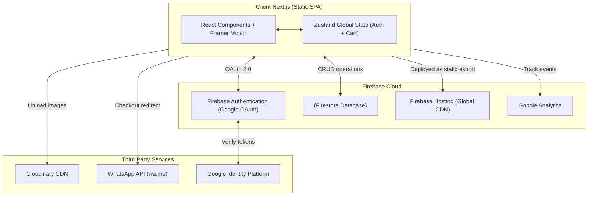
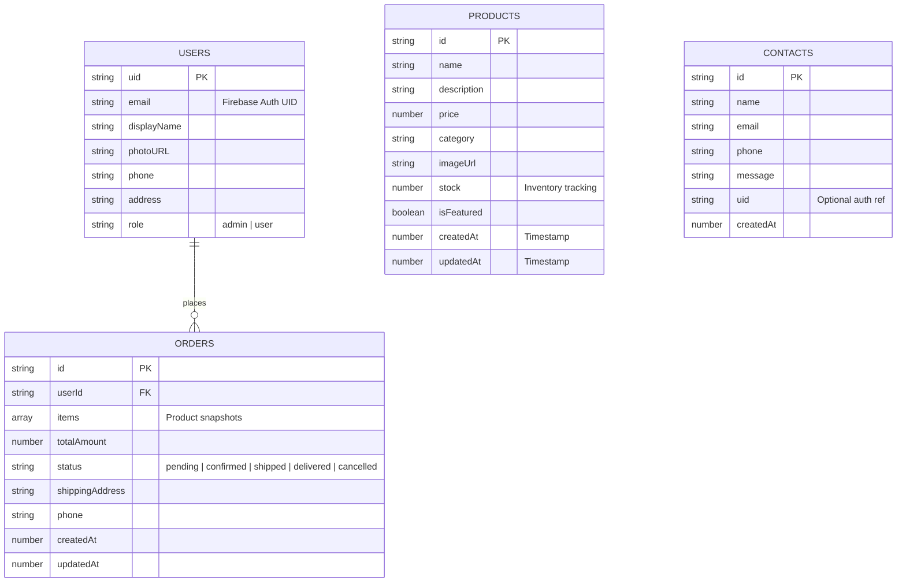
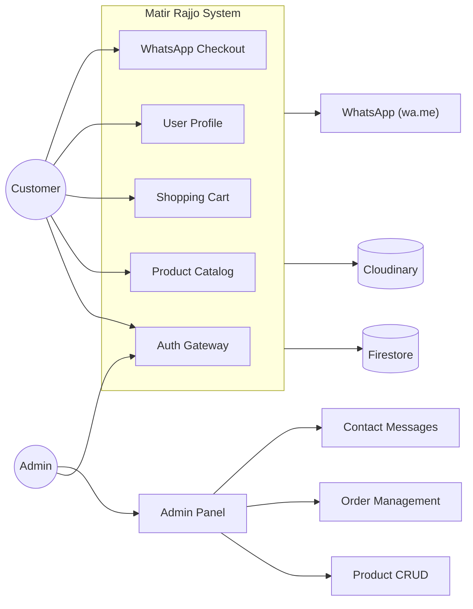
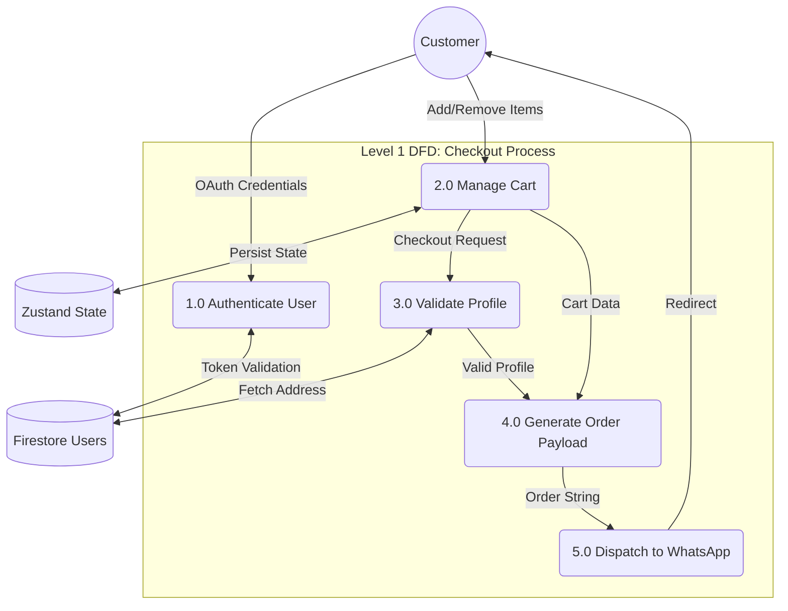
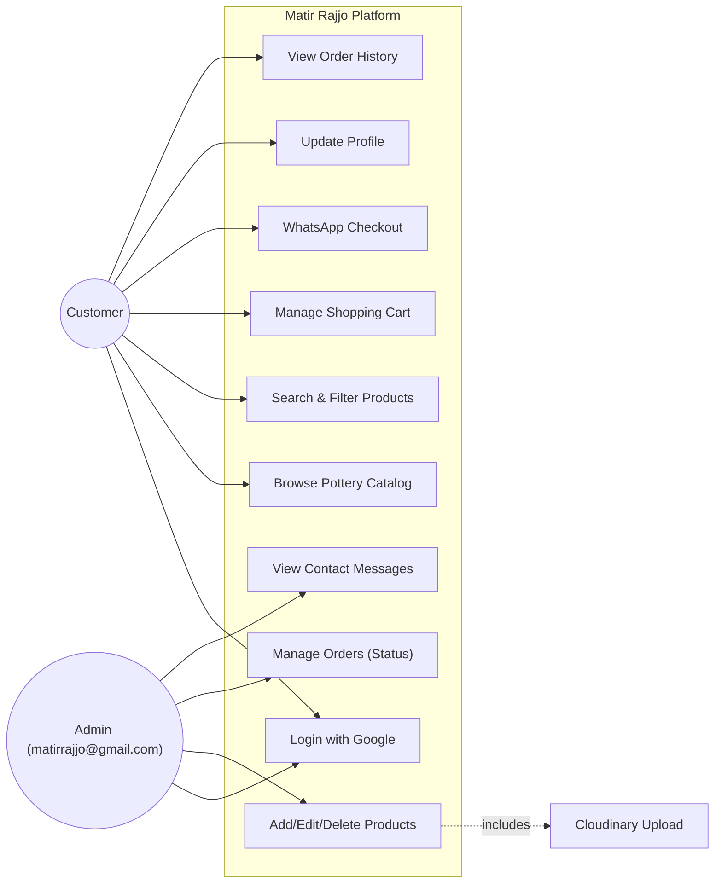
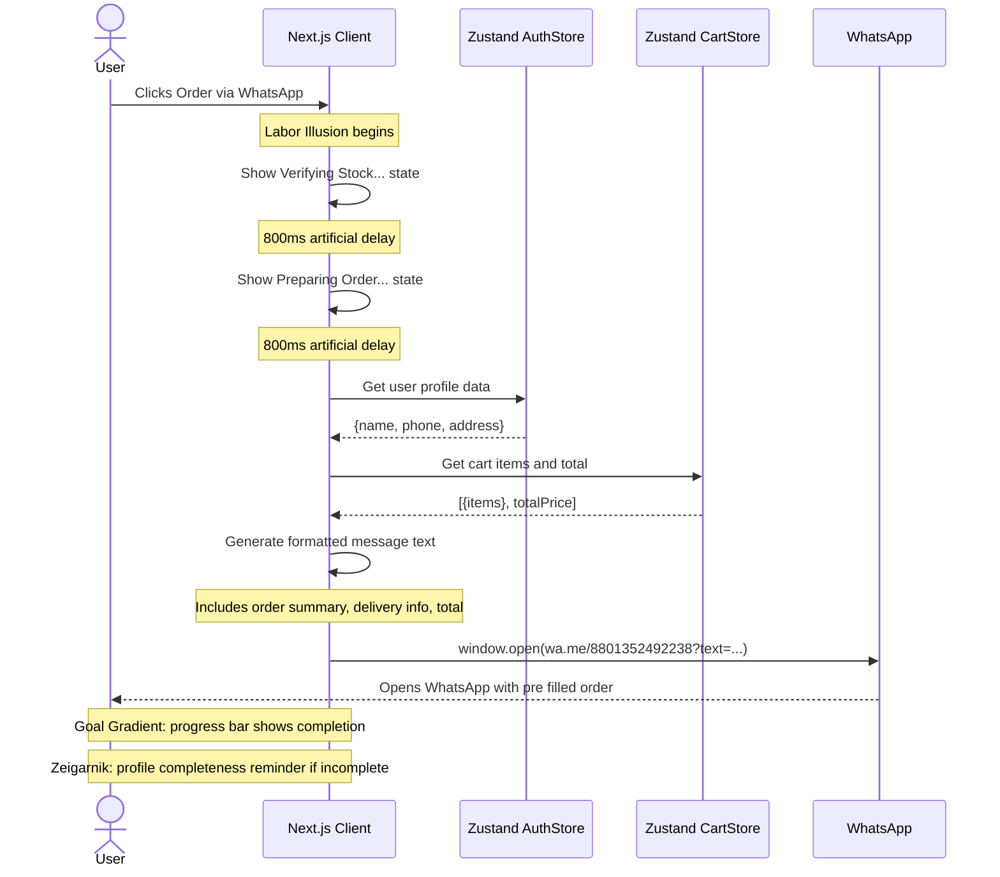

# Matir Rajjo: The Engineering Manifesto

<div align="center">
  
  <br />
  <h3>Where Bengali Heritage Meets World Class Software Engineering</h3>
  <p>
    <strong>Designed & Engineered by</strong><br />
    <a href="https://kholipha-ahmmad-al-amin.equisaas-bd.com/">Kholipha Ahmmad Al-Amin</a><br />
    <em>Founder & CEO, EquiSaaS BD | Principal Consultant, AR IT Consultancy</em>
  </p>
</div>

## The Problem

Bangladesh's pottery industry spans thousands of years of cultural heritage. Yet today, it faces extinction. The root cause is not a lack of craftsmanship but a lack of digital infrastructure. Local artisans create world class products but cannot reach urban consumers. Existing ecommerce platforms are too generic, visually disconnected from the handcrafted aesthetic, and fail to build the trust required for purchasing fragile, premium clay goods. The result: masterpieces collect dust in rural workshops while city dwellers buy imported plastic decor.

## The Solution

Matir Rajjo is not an ecommerce store. It is a digital preservation system for Bengali heritage, engineered with the rigor of a Silicon Valley product. We bridge the artisan to consumer gap through a stack designed for speed, trust, and conversion. Every pixel, every micro interaction, every loading state is deliberately engineered using behavioral psychology principles to maximize completion rates and customer satisfaction.

## Live Demo & Tech Stack

**Production Environment:** [https://matir-rajjo.equisaas-bd.com/](https://matir-rajjo.equisaas-bd.com/)

| Layer | Technology | Purpose |
|-------|-----------|---------|
| **Framework** | Next.js 14+ (App Router) | SSR capable React metaframework |
| **Language** | TypeScript (strict mode) | Type safety across the entire codebase |
| **State** | Zustand + persist middleware | Lightweight global state with localStorage hydration |
| **Styling** | Tailwind CSS v4 + shadcn/ui | Utility first design system with CSS variables |
| **Animation** | Framer Motion | Physics based micro interactions and page transitions |
| **3D Rendering** | React Three Fiber + Drei | Interactive 3D pot model on the landing page |
| **Backend** | Firebase Auth + Firestore | Serverless BaaS with real time capabilities |
| **Media** | Cloudinary CDN | Image optimization and delivery |
| **Deployment** | Firebase Hosting (static export) | Global CDN with zero cold starts |
| **Analytics** | Firebase Google Analytics | User behavior tracking |

## Local Setup & Run Instructions

Execute the following commands in your terminal to initialize the environment locally.

```bash
git clone https://github.com/kholipha-ahmmad-al-amin/matir-rajjo.git
cd "matir-rajjo/web"
npm install
cp .env.example .env.local
npm run dev
```
Open `http://localhost:3000` in your browser. Ensure your `.env.local` contains valid Firebase and Cloudinary credentials.

## System Documentation

### System Architecture Diagram



### Entity Relationship Diagram (Firebase)



### Data Flow Diagram (Level 0)



### Data Flow Diagram (Level 1)



### Use Case Diagram



### Sequence Diagram


